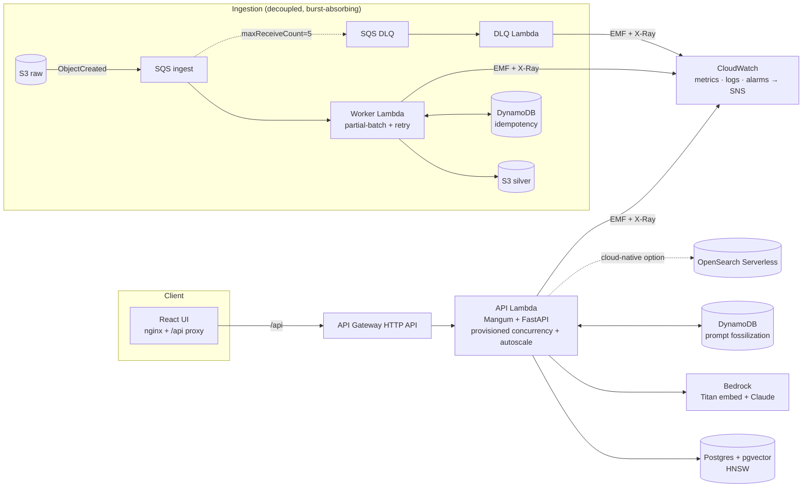

# FossilRAG — Architecture

The serverless document-enrichment & retrieval system, end to end. Built
walking-skeleton-first across PR0–PR15 (the spine ran from PR0; each PR deepened
one stage with `main` always demoable) — this describes the shipped system.

## Principles

1. **Walking skeleton first.** The end-to-end path runs from day one at trivial
   fidelity; each PR deepens exactly one stage. `main` is always demoable.
2. **$0-verifiable vs AWS-only.** Anything that can be exercised for free
   (Postgres/pgvector, the API, the mock embedder) is the *tested/demoed* path.
   Anything that costs money or can't be emulated at $0 (Bedrock, OpenSearch
   Serverless) is behind an interface, mock-defaulted, and IaC-validated — never
   claimed as "ran live."
3. **Idempotency everywhere.** Identity is content-addressed (`doc_id`,
   `chunk_id` are SHA-256 digests), so re-processing is a no-op.
4. **Provenance is first-class.** Every vector records its `(model_id, dim)`;
   indexes built by one model are never queried by another.

## Medallion data flow

| Layer  | Produced by | Shape | PR0 fidelity |
|--------|-------------|-------|--------------|
| raw    | upload (S3 raw bucket, later) | original bytes | local bytes |
| silver | `ingest.extract` + `ingest.handler` (S3 Lambda) | `RawDocument` (text + provenance) | txt/md/pdf/pptx; S3 raw→silver |
| gold   | `chunking` (clean + semantic) | `Chunk[]` (fossil fragments) + JSONL/Parquet | clean + token-aware chunks w/ overlap; versioned layers |
| vector | `embedding` (mock/local/Bedrock) + `vectorstore` | `(model_id, dim)` index | pluggable embedder; DynamoDB idempotency skip; pgvector |
| served | `api` (+ `llm`, `enrichment`, `dataset`) | hits, summaries, layers, diffs, markers, chat, edits, datasets | `/excavate`; `/mutate`; `/timetravel`; `/diff`; `/enrich`+`/markers`; `/chat`; `/slide/mutate`; `/dataset` (JSONL fine-tune pairs) |

## Serverless topology (deployed)



## Request flow

```
  POST /ingest ──► pipeline.ingest_document
                      ├─ ingest.extract_document   (bytes → RawDocument)      [silver]
                      ├─ chunking.chunk_document    (RawDocument → Chunk[])    [gold]
                      ├─ embedding.Embedder.encode  (Chunk[] → float32[N,dim])
                      └─ vectorstore.upsert_chunks  (idempotent, ON CONFLICT)  [vector]

  GET /excavate ──► embedder.encode_one(q) ──► vectorstore.search(qv, k) ──► ExcavateHit[]
  (every request → RequestContextMiddleware: X-Request-ID + EMF RequestLatencyMs)
```

## Interfaces (the seams later PRs plug into)

- `embedding.base.Embedder` — `model_id`, `dimensions`, `encode`, `encode_one`.
  Impls: `MockEmbedder` (PR0); `LocalEmbedder` (sentence-transformers, PR3);
  `BedrockEmbedder` (Titan v2, PR3).
- `vectorstore.base.VectorStore` — `bootstrap`, `upsert_chunks`, `search`,
  `healthcheck`, `close`, `stats`. Impl: `PgVectorStore` is the only shipped
  backend. OpenSearch Serverless is IaC-provisioned (`infra/opensearch.tf`) but
  not yet bound behind the interface — an `OpenSearchStore` is the documented
  next step (see ADR 0001).

## Vector search (pgvector)

- Type `vector(dim)`, dim from config (384 default).
- **HNSW** index with `vector_cosine_ops`, queried with the `<=>` cosine
  operator (operator must match the opclass or pgvector silently does a seq
  scan). Recall tuned per-session via `SET LOCAL hnsw.ef_search` (≥ top-k).
- Mock vectors are L2-normalised, so cosine similarity is well-defined and
  identical text retrieves itself at score ≈ 1.0.

## Local vs CI vs cloud

| Concern | Local ($0) | CI | Cloud (live) |
|---------|-----------|-----|--------------|
| Vector store | pgvector (compose) | pgvector service container | RDS/Aurora pgvector (AOSS provisioned, binding TBD) |
| Embedder | mock / local | mock | Bedrock Titan v2 |
| LLM (`/mutate`) | mock / Ollama | mock | Bedrock Claude (Converse) |
| AWS services | moto (tests) / LocalStack (demo) | moto | real AWS |
| e2e | (no Docker on dev box) | `docker compose up` + smoke | — |

See [`adr/0001-foundational-decisions.md`](adr/0001-foundational-decisions.md)
for the dated research behind every version and choice above.
